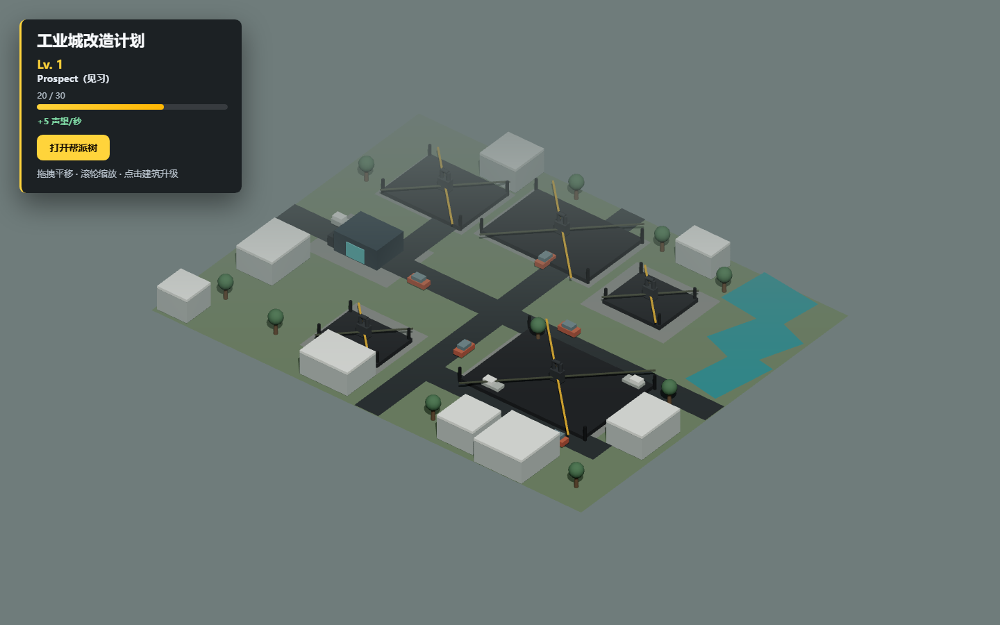

# DobeDemo：工业城市帮派树 Demo

一个基于 React、Three.js 与 React Three Fiber 的浏览器 3D 游戏 Demo。玩家通过挂机获得帮派声望，在 1–50 级职位树中晋升，逐步解锁工业城市建筑，并经营钱、油、物资三种资源来自由升级每座建筑的独立子建筑。

## 在线体验

**GitHub Pages：<https://sherlock3rd.github.io/DobeDemo/>**

> 首次发布完成后即可直接访问。进度保存在浏览器本地，不需要账号。



## 核心玩法

- 固定俯视正交镜头，支持左键/右键/单指拖动平移与滚轮/双指缩放。
- 在线每 10 秒获得 1 点声望，支持最多 8 小时离线收益，HUD 显示 `+1 声望/10秒`。
- 1–50 级帮派树，共 7 个职位。
- 初始仅拥有修车厂。
- 建筑依次解锁：
  1. Lv.1 修车厂
  2. Lv.8 废车回收厂
  3. Lv.16 商业街
  4. Lv.24 金属加工厂
  5. Lv.32 加油站
  6. Lv.40 Clubhouse

### 独立子建筑升级

- 修车厂拥有 5 个子建筑，其余五座建筑各拥有 10 个子建筑。
- 子建筑从 Lv.0（未建设）开始，玩家可任意顺序自由升级，不存在固定碎片顺序。
- 子建筑等级不得高于所属主建筑；当所有子建筑都追平主建筑当前等级时，主建筑才可升级。
- Clubhouse 主/子建筑最高 Lv.10，其余建筑最高 Lv.5；非 Clubhouse 建筑的目标等级不得高于 Clubhouse 当前等级。
- Clubhouse 尚未解锁时提示 `需要先将帮派树提升至 Lv.40 解锁 Clubhouse`；Clubhouse 等级不足时提示 `需要先将 Clubhouse 提升至 Lv.N`。
- 子建筑升级会按其自身等级重建 3D 部件，仅本次点击升级的子建筑播放 400ms 绿色入场动画；刷新/rehydrate 不重播。

### 资源经济

- 三种资源：钱、油、物资，均为非负整数，HUD 常驻显示余额与每 10 秒产量。
- 每 10 秒结算一个生产 tick，离线最多结算 8 小时；不足一个 tick 的时间余量保留到下次。
- 生产建筑：修车厂与商业街产钱、加油站产油、金属加工厂产物资；废车回收厂与 Clubhouse 本版不产出。
- 生产只来自已解锁且已激活的建筑，新解锁建筑不会追溯上线前的收益。
- 子建筑与主建筑升级都在同一次原子操作中先结算生产、再校验门槛并扣费；余额不足时严格不升级。
- 可调数值（生产速率、离线上限、各级升级成本）集中在 `src/config/economy.config.json`，由带校验的解析器加载。
- 未解锁建筑显示施工地块和锁定标识，点击后可查看解锁条件。
- 城市存档（子建筑等级、资源钱包、生产时间、激活生产建筑）与帮派声望均通过 `localStorage` 持久化（城市存档键 `dobe-city-progression-v1`，版本 2），刷新后恢复。

## 职位等级

| 等级  | 职位                      |
| ----- | ------------------------- |
| 1–7   | Prospect（见习）          |
| 8–15  | Full Patch（正式成员）    |
| 16–23 | Wrench（技术骨干）        |
| 24–31 | Bar Liaison（酒吧联络人） |
| 32–39 | Road Captain（路线队长）  |
| 40–49 | V. PRESIDENT（副主席）    |
| 50    | PRESIDENT（主席）         |

## 操作

- 左键 / 右键按住拖动：平移城市。
- 单指拖动：平移城市。
- 鼠标滚轮 / 双指捏合：缩放城市。
- 点击建筑或锁定地块：查看建筑信息与升级面板（拖动超过 6px 后松开不会误触发选中）。
- 在升级面板点击“升级 <子建筑名> 至 Lv.N”自由升级任一子建筑；全部子建筑追平主建筑后点击“升级主建筑至 Lv.N”完成主建筑升级（均需扣除资源成本）。
- 点击“打开帮派树”：查看 50 级完整进度。
- 点击“设置”：打开调试设置；“重置账号”后还需点击“确认重置账号”，才会把帮派声望、挂机时间、建筑解锁、主/子建筑等级和资源钱包恢复为当前浏览器的初始账号。
- Escape：关闭已打开的帮派树或调试设置。

## 技术栈

- React 19 + TypeScript
- Three.js
- React Three Fiber + Drei
- Zustand
- Vite
- Vitest + React Testing Library
- ESLint + Prettier
- GitHub Pages

## 本地运行

环境要求：Node.js 22 或兼容版本。

```bash
npm install
npm run dev
```

浏览器访问 Vite 输出的本地地址。

## 验证命令

```bash
npm run format:check
npm run typecheck
npm run lint
npm test
npm run build
```

当前验收基线：37 个测试文件、420 项测试。

独立子建筑经济的可重复浏览器验收脚本为 `.superpowers/sdd/independent-economy-cdp.mjs`（安全模式：动态选择空闲端口、`--strictPort`、仅终止脚本自建 PID、临时 profile 删除前校验前缀、结果 JSON 只记录 basename、错误脱敏、坏数据自测、失败非零退出）。它覆盖 fresh v2 存档、10 秒钱产出、真实点击第五个修车厂子建筑并校验数组与 3D ROI 变化、两条 Clubhouse 门槛文本、Clubhouse→修车厂真实升级闭环、刷新持久化、三资源 10 秒增长、Lv.5/Lv.10 上限禁用与 390×844 移动面板，结果与截图见 `.superpowers/sdd/independent-economy-*`。

碎片升级的历史验收脚本为 `.superpowers/sdd/fragmented-upgrades-cdp.mjs`，设置重置的历史验收脚本为 `.superpowers/sdd/settings-reset-cdp.mjs`，结果与截图分别见对应前缀文件。

### 配置契约

`src/config/economy.config.json` 冻结了后续独立“配置 EXE”读写的稳定 JSON 契约（版本、tick、离线上限、各生产建筑速率、1–10 子建筑成本与 2–10 主建筑成本）。第一版所有升级成本仅消耗钱，但结构与 UI 已支持三资源。本次仅冻结该契约与校验器，不实现配置 EXE。

## GitHub Pages 部署

生产构建会把 Vite base 自动切换为 `/DobeDemo/`。发布时将 `dist/` 内容提交到 `gh-pages` 分支，GitHub Pages 从该分支根目录提供公开体验；本地开发服务器继续使用根路径。

## 项目结构

```text
src/
├─ game/        帮派等级、挂机、建筑目录和城市布局
├─ scene/city/  3D 城市、建筑模型和锁定地块
├─ store/       城市与帮派 Zustand 状态
├─ ui/          HUD、建筑面板和帮派树
└─ test/        测试环境
```

详细设计、实施计划和验收记录位于 `docs/`、`session/` 与 `.superpowers/sdd/`。

## 当前边界

- 本地 Demo，无后端、账号或云存档。
- 不包含服务器校时或防作弊。
- 帮派声望、子建筑等级与资源钱包均会持久化，刷新后恢复；无服务器校时。
- 第一版不实际消耗油或物资（成本结构保留三资源），也不为废车回收厂/Clubhouse 配置产出。
- 不制作配置 EXE，仅冻结其未来读写的 JSON 契约。
- 3D 资产均为程序化基础几何体，不是正式美术资源。
