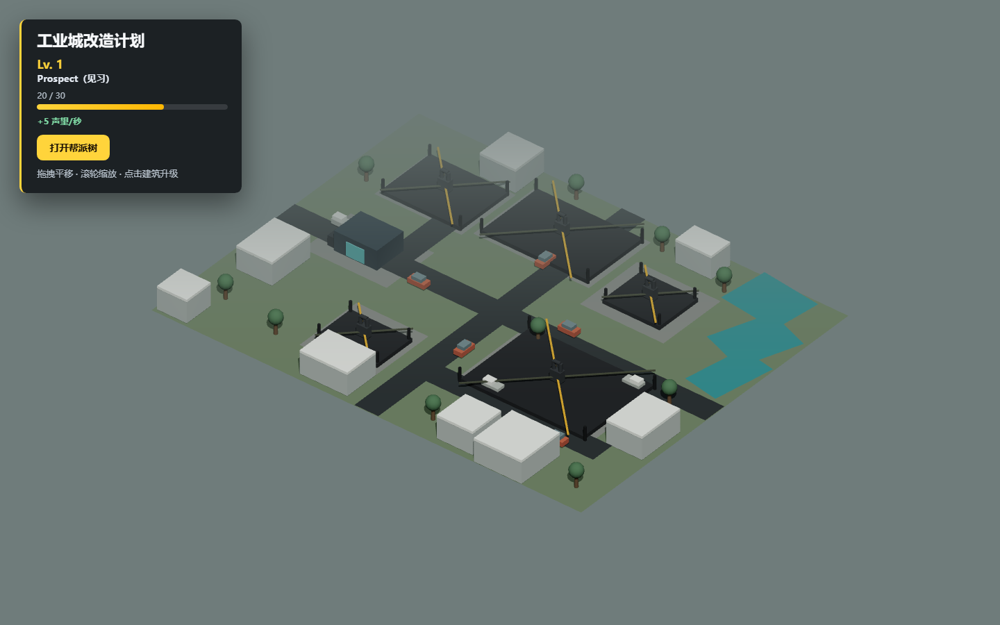

# DobeDemo：工业城市帮派树 Demo

一个基于 React、Three.js 与 React Three Fiber 的浏览器 3D 游戏 Demo。玩家通过章节任务获得帮派经验，在 1–50 级职位树中晋升，经营工业城市，并让英雄携带车辆与枪械参与自动战役和原创 2.5D 公路竞速/追击玩法。

## 在线体验

**GitHub Pages：<https://sherlock3rd.github.io/DobeDemo/>**

> 首次发布完成后即可直接访问。进度保存在浏览器本地，不需要账号。
>
> 当前线上版本已包含七章职级任务、显式帮派晋升、HUD 方案 B、真实怒气、五品质与废车回收厂生产 Tab 手动领取。



## 核心玩法

- 固定俯视正交镜头，支持左键/右键/单指拖动平移与滚轮/双指缩放。
- 帮派经验仅由章节任务及章节完成奖励投放，不再提供在线或离线挂机帮派经验；主 HUD 只显示当前资源余额，不显示增量。
- 1–50 级帮派树，共 7 个职位；七个重要席位沿中央权力线由上至下排列，主席在最上、见习在最下，Thomas 位于自己当前职级的高度，前任负责人显示在同层侧边。点击人物可查看职位、关系与直属成员。声望作为帮派经验累计，玩家需在帮派树逐级点击“晋升一级”。
- 普通等级继续直接晋升；跨入六个重要职位时必须先完成席位交接。正式成员、酒吧联络人和主席采用多句和平对话交接，技术骨干和副主席采用独立推关挑战，路线队长采用独立 SUP 竞速挑战。挑战胜利只完成职位交接，不重复结算普通推关或赛车进度与奖励，随后统一播放晋升演出。
- 七个职位分别对应七章任务。当前章节作为独立存档状态，仅在评定会议确认下一章任务包后推进；帮派树继续负责等级、职位和功能解锁，但不再开启会议。跨入下一职位前仍必须完成对应章节。
- 主 HUD 左下角悬浮章节入口展示“当前章 / 总章数”。章节任务界面只显示紧凑的“当前第 N 章”标识，不预览后续章节；下方保留当前章剧情、完成数、任务进度、对应玩法/建筑跳转和单项手动领取。每章任务由评定会议选择的任务包与固定额外任务合并而成；第一章直接发布初始任务。全部任务完成后可通过“完成章节并参加评定会议”领取章节奖励并进入下一轮。
- 会议任务包覆盖物资、城建和养成三类目标，包括钱/油/物资/零件、建筑等级、英雄等级、枪械强化、车辆配件强化次数、账号总战力和指定车辆最高战力。每章固定额外任务包含职位声望、推关进度和 SUP 玩法进度；第一章 SUP 任务继续投放四部位完整史诗（紫色）套装。
- 城市建筑始终属于剃刀党；玩家通过晋升获得更多内部管理权限。帮派等级达到要求后，地图对应地块会出现带建筑名的金色“可接管”管理权图标；点击图标后先观看金属小锤落槌、火花与“接管生效”管理权交接弹屏，再听取负责人立绘简报，随后才开放该建筑的模型、生产、升级和章节跳转。Lv.1 修车厂也必须先完成这套首次交接。
- 建筑依次解锁：
  1. Lv.1 修车厂
  2. Lv.8 废车回收厂
  3. Lv.16 商业街
  4. Lv.24 金属加工厂
  5. Lv.32 加油站
  6. Lv.40 Clubhouse

### 渐进式子建筑与 Clubhouse 直接升级

- 六类建筑主等级统一为 `1…10`，最高 Lv.10。
- 修车厂与废车回收厂、商业街、金属加工厂、加油站保留渐进式子建筑流程；子建筑等级为 `0…10`，Lv.0 表示已解锁但尚未建设，且永不高于所属主建筑。
- 槽位随主等级逐槽解锁：修车厂使用前 5 个槽（主 Lv.1–5 解锁 1–5 个，Lv.6–10 保持 5 个），其余四座子建筑型建筑各使用 10 个槽（主 Lv.1–10 解锁 1–10 个）。
- 未解锁槽位在建筑面板与 3D 场景中完全不存在：不显示卡片、脚手架、占位或标签，也无法被键盘或程序化升级；只有已解锁的 Lv.0 槽才显示脚手架。
- 详情页只有一个「选中项 + 公用升级按钮」，按钮文案为 `升级「名称」至 Lv.N · 钱 A · 油 B · 物资 C`（零成本项省略），一次只升当前选中槽一级。
- 进度区带 `role="progressbar"` 与整数百分比文案；每次子升级完成步数 +1，只有精确 100% 才显示 `100%`。
- 已解锁槽全部追平主等级时，进度区仍显示精确 `100%`，公用子升级按钮隐藏，并在下方显示 `升级主建筑至 Lv.N` 按钮。
- 点击主升级按钮不扣费、不升级，只进入同一面板内的独立确认页；确认页展示目标等级、钱/油/物资完整成本、`当前建筑战力 P` / `本次战力 +D` / `升级后战力 Q`、阻止原因与「返回 / 确认升级」。战力仅用于展示，不参与生产、解锁或门槛判定。
- Clubhouse 不显示 radio、子建筑、阶段进度或主升级确认页。详情页直接显示当前/增量/目标战力和主建筑成本；点击 `直接升级 Clubhouse 至 Lv.N` 会先结算生产，再原子校验资源、扣费并把主等级 +1。
- Clubhouse 的统一存档结构仍保留 10 个 `childLevels`，但运行期恒为全 0，Store 子升级路径拒绝它；3D 直接按主等级 Lv.N 渲染前 N 个完成态视觉层，不显示脚手架或子升级动画。
- 主升级门槛只判断即将到达的目标等级：修车厂目标 Lv.2–5 无外部门槛、Lv.6–10 不得高于 Clubhouse 当前等级；其余四类目标 Lv.2–5 不得高于修车厂当前等级、Lv.6–10 不得高于 Clubhouse 当前等级；Clubhouse 只受帮派 Lv.40 解锁、资源与 Lv.10 上限约束。
- 阻止原因按固定优先级短路：`building-locked` → `已达到最高等级 Lv.10` → 子建筑未追平 → `需要先将修车厂提升至 Lv.N` → `需要先将帮派树提升至 Lv.40 解锁 Clubhouse` → `需要先将 Clubhouse 提升至 Lv.N` → `资源不足，还需 …`。
- 六座主建筑（含 Clubhouse）确认后立即扣费并进入施工队列，全城最多同时施工两座；目标 Lv.2–10 的耗时依次为 10/20/30 秒、1/2/3/5/8/10 分钟，刷新或离线后按绝对完成时间继续结算。子建筑仍即时完成。
- 施工期间，对应 3D 建筑上方显示“修建中”图标、目标等级、实时剩余时间和进度条；施工到期结算后状态牌自动消失。
- 确认成功后一次性扣费并进入队列；施工到期才使主等级 +1，并按 blueprint 顺序自动选中新解锁的 Lv.0 槽（修车厂 Lv.5→6 无新槽时选择首个未追平槽）。
- 子建筑升级会按其自身等级重建 3D 部件，仅本次点击升级的子建筑播放 400ms 绿色入场动画；主升级解锁新槽、刷新/rehydrate、迁移与重置都不重播。

### 资源经济

- 三种资源：钱、油、物资，均为非负整数；主 HUD 以图标只显示三格余额，不显示增量。账号总战力（全部已解锁英雄当前装备战力 + 全部已解锁主建筑已完成等级战力）并入帮派徽标，不再占用独立一行。
- 每 10 秒结算一个生产 tick，离线最多结算 8 小时；不足一个 tick 的时间余量保留到下次。
- 生产建筑：修车厂与商业街产钱、加油站产油、金属加工厂产物资；废车回收厂独立累计车辆配件批次，玩家在建筑面板“生产”Tab 手动领取后才随机生成并写入仓库，Clubhouse 本版不产出。
- 生产只来自已完成管理权交接且已激活的建筑；仅达到帮派等级不会自动获得管理权或追溯上线前收益。
- 新账号与重置账号后钱包固定为 `钱 10000、油 0、物资 0`。
- 子建筑与主建筑升级都在同一次原子操作中先结算生产、再用最新钱包重查门槛并扣费；余额不足或任一门槛不满足时严格不升级、不扣费。
- 可调数值（生产速率、离线上限、各级升级成本、各建筑 Lv.1–10 战力）集中在 `src/config/economy.config.json`（schema 版本 2），由带校验的解析器加载；战力必须严格递增、非负、安全整数。
- 等级未达要求的建筑显示施工地块和锁定标识；等级达标后地块转为金色可接管管理权状态，只有明确完成内部交接后才能进入详情。
- 城市存档（主/子建筑等级、资源钱包、生产时间、已获管理权建筑、激活生产建筑）、显式帮派等级/声望、章节领取记录、当前章节、会议选择与已观看剧情均通过 `localStorage` 持久化；城市 persist 当前为 v7，章节 persist 为 v6，英雄/装备 persist 为 v8。章节旧档会按首个未完成章节迁移显式章节状态并补入兼容任务包，已完成第一章的旧中性票会统一迁移为“正式成员转正通过”，不重播已结束会议；英雄/装备旧档会补入配件累计强化次数。城市 v6 及更早存档保留建筑等级和资源，但重新开放一次管理权交接，确保现有账号也能看到地图按钮。选中子槽、详情/确认页与动画属于本次面板会话，不持久化。
- 存档从 v2 升级到 v3 时，对被新逐槽规则隐藏的旧子建筑等级按 v2 冻结价格一次性退款并清零，v3 rehydrate 不重复退款；v1 存档只做形态映射与隐藏槽清零、不退款。
- 存档从 v3 升级到 v4 时，按当前子升级成本一次性退还旧 Clubhouse 子投入并把其 10 个 `childLevels` 清零；v4 再次 hydrate 不重复退款，钱包使用饱和加法。

### 战役、英雄与全局 HUD

- 战役共 2 章 20 关；推关面板始终只显示唯一的下一关，已通关关卡不能重复挑战；胜利结算提供“退出”和“下一关”，后者跳过编队直接连续开战，最终关只保留退出；每关敌人从 1 名递增到 5 名，编队固定为前排 2 个、后排 3 个阵位。
- 推关战斗使用高位透视镜头，整套阵位、单位、弹道和伤害表现沿左下至右上的斜向交战轴排列：我方位于左下近景，敌方位于右上远景；地面边界保持稳定，不随交战轴侧转。
- 战斗由确定性的 100ms tick 引擎预演；走位、普攻与技能施放全部自动完成，没有 `Auto` 开关或手动施法按钮，同一输入始终得到同一结果。玩家英雄初始怒气 0、上限 100，普攻命中 +20、每次受击 +10，满怒后于下一次行动自动施放技能并清空；敌人继续使用冷却技能。真实 `useFrame` 表现覆盖走位、lunge、死亡 tween、basic 枪火/命中和 skill 金色齐射拖尾；reduced motion 关闭非必要 tween 但不改变事件与结果。
- 首版三名英雄分别在帮派 Lv.1、Lv.12、Lv.28 解锁；英雄等级最高 Lv.50 且不能超过当前帮派等级。推关与赛车首通奖励为英雄经验、钱和概率配件，培养页从共享经验池扣费升级。
- 通关后开启英雄经验挂机：每 10 秒结算一次，离线最多累计 8 小时；推关页宝箱按已通关进度派生可领取经验，领取时保留不足一个 tick 的时间余量。
- `PROGRESSION_UNLOCKS` 是建筑、英雄、车辆、枪械和玩法入口的统一解锁来源；`解锁帮派树` 调试动作升至 Lv.50 后，全部内容从同一规则即时派生解锁。
- 全局 `GlobalHud` 在城市主界面以共享 SVG 图标显示钱、油、物资数量，并把账号总战力放在帮派按钮内；同时提供左侧章节悬浮入口及赛车/推关/英雄/设置入口。英雄经验保留在推关与英雄培养界面。打开建筑详情、章节、赛车、推关、编队、英雄、帮派树、设置、里程碑弹屏、立绘对话或战斗覆盖层时，HUD 会隐藏并 inert，关闭覆盖层后恢复。应用只允许一个玩法覆盖层；剧情队列按事件顺序播放且同一事件只播放一次。
- 首次进入会依次播放开场和第一章说明，然后直接发布第一章任务。完成一章后，玩家在章节体点击完成按钮，先观看章节收束剧情，再由章节体开启不可跳过的评定会议；帮派树晋升只播放职位交接，不触发会议。第一章会议唯一的投票事件是以固定 5 席赞成、1 席保留表决 Thomas 能否转正成为正式成员；结果和专属立绘对话结束后直接开放三个任务包，不再进行第二轮中性事件表决。第六章结算会议仍先以固定 6 席一致赞成表决主席继任资格，再继续该章的中性事件表决。第二至第六章的普通会议针对当前剧情事件提供两个不带对错倾向的中性选项并展示固定委员会票型，再开放三个任务包供玩家三选一，三个包分别包含 1、2、3 个会议合集任务。确认后，新章任务由所选任务包与“职位声望 / 推关 / SUP”三项固定额外任务组成，播放新章说明并前往帮派树处理职位晋升；第七章完成后结束。
- 战斗退出需要二次确认；确认态会冻结战斗并阻止胜利/首通/经验发奖。Overlay 打开时标题获得焦点、背景变为 `inert`，关闭后焦点恢复到触发点。
- 英雄战役存档键继续使用 `dobe-adventure-progression-v1`，当前 persist 版本为 v8；旧档中超过最高英雄等级的枪械或配件会降到合法等级，并完整返还超出部分的逐级强化零件。v5 及更早存档的四类旧品质会安全映射到五品质体系，保留配件 ID、部位、等级与安装关系。
- Store 拒绝锁定英雄和非法帮派等级请求；配置及派生计算校验 safe integer、英雄 `defaultSlot` 与数值溢出。
- 建筑进度表示“当前主建筑等级这一阶段”的完成度；阶段完成后仍保留精确 `100%` 进度，并同时显示主建筑升级按钮。

### 公路争霸与英雄装备

- 英雄培养界面采用“左侧英雄名单 + 中央英雄与战力 + 右侧养成”的三栏结构，桌面弹窗和手机单层滚动布局共用“等级 / 车辆 / 枪械”三个清晰页签。英雄战力位于姓名行，技能卡展示效果说明、倍率、当前属性预估伤害及“怒气 100 / 普攻 +20 / 受击 +10 / 满怒自动释放”。车辆和枪械页会先展示该英雄的当前装备与养成入口，点击“更换车辆 / 更换枪械”才进入独立装备选择界面；选择页会标明当前装备、其他英雄占用或车库/武器库待命状态，完成切换后自动返回当前装备页。
- 英雄等级只消耗共享英雄经验升级；枪械和配件硬上限均为 Lv.50，实际强化等级不得超过账号内最高英雄等级。Lv.10 后采用递减成长，强化继续提高推关、竞速与追击实战属性。
- 每辆车拥有轮胎、引擎、保险杠、悬挂四个固定配件槽，配件只能安装到对应部位。配件绑定车辆而非英雄，因此换英雄驾驶时整套配件随车保留；仓库支持按普通/优秀/精良/史诗/传说品质一键回收，已安装配件会自动排除。
- 废车回收厂在帮派 Lv.8 解锁后开始累计配件生产批次，主建筑 Lv.1–10 的间隔由 30 秒逐级缩短至 12 秒，单批数量由固定 1 件提升到 Lv.10 的 2–4 件，离线最多累计 8 小时。只有点击“生产”Tab 的领取按钮才会随机结算；仓库上限 40 件，满仓后的新配件自动回收为零件。
- 配件分为普通、优秀、精良、史诗、传说五种品质；数量和品质均为真随机，等级越高则单批数量和高品质概率越高，Lv.10 传说概率为 25%。随机源可在自动化测试中注入，设置页会完整展示五品质概率（包括 0%）。
- 新增原创 2.5D 公路街机玩法，共 10 关，竞速与追击枪战交替出现；每关目标时长约 45–65 秒。
- 大厅始终只显示唯一的下一关；通关上一关才开放下一关，已通关关卡不显示、不可重复挑战，10 关后显示全部完成。
- 三车道高速自动前进：点按 `←/→`、`A/D` 或触屏方向按钮换道，长按方向进入物理漂移；空中继续按方向可完成翻滚特技。竞速关使用空格/触屏“氮气”释放加速，追击关只使用 `F`/触屏“火力强化”。
- 氮气固定为三格，所有车辆开局均为 0；至少蓄满一格才能释放，普通释放消耗一格并获得 1.8 秒冲刺。满三格时双击会耗尽全部氮气，触发 3.2 秒超级加速和高空飞跃；竞速时落后领跑者超过 4 米便会按距离差额外补氮，落后 AI 的追赶补充最高约 42 点/秒，并会更积极地释放普通氮气，保留型 AI 则会蓄满发动超级飞跃。
- 竞速关为玩家加六辆 AI 的七车同场，最终排名前三均可通关并领取首通奖励，第四至第七名判定失败；玩家车辆固定使用绿色车身和车顶标记。每辆车都有独立质量、速度、横向惯性、偏航、耐久与悬挂参数；AI 会基于领跑者距离动态追赶、提前规避路障并从侧面尝试超车。前后追撞会按质量与相对速度交换动量，后车减速、前车受推加速，氮气冲撞还会产生额外破坏。
- 五个竞速关不再倒计时，也不会因时间耗尽判负；HUD 只显示紧凑的终点距离百分比进度条。路线在上一版基础上加长 50%，由 4650 米逐步增加到 6300 米，最快通关目标约一分钟。公路使用矮橙色护栏表现普通路障，跳台则使用高耸的青色倾斜坡面、黄色导向纹、发光侧栏和入口门架，确保高速下可以提前辨认。普通跳台滞空约 1.5–2.3 秒，为上一版长滞空的一半；玩家与 AI 都会飞坡、翻滚并落地。成功特技一次补充大量氮气，成为氮气主要来源；自然回复降至初版一半，漂移和尾流只提供辅助补充。任意车辆若以偏离直立姿态 0.2 圈以上的角度落地，会瞬间降至约 62% 车速；玩家还会损失耐久。
- 五个追击关按关卡固定为 0/1/1/2/2 辆护卫，不动态补位；第一个追击关没有护卫。追击完全关闭氮气，只保留纯枪战。普通攻击持续自动开火，伤害由枪械基础值与强化等级决定；车辆耐久直接由车辆基础值与已装配件决定，不再固定翻倍。`F`/触屏按钮触发约 2.4 秒火力强化，干净空中特技缩短 2.5 秒冷却。
- 赛车镜头采用高位远距追踪，并随速度提高镜头高度、扩大视野及前方注视距离；超级飞跃时会继续向上跟随。普通氮气显示蓝色尾焰，超级氮气增加紫色双尾焰、冲击环和强化速度线。车辆耐久耗尽、目标逃脱或超时都会失败。
- 车辆与枪械都是英雄唯一装备：每名英雄各有一个车位和枪位，同一装备改配给另一英雄时会从原持有者身上原子卸下。
- 三名英雄改为浴血黑帮姓名库：主角 Thomas Shelby（Tommy）、Arthur Shelby（Arthur）与 Polly Gray（Aunt Polly）。初始向 Thomas Shelby 发放并装备“灰狐旧改车”和“铆钉冲锋枪”；“铁獠装甲车”“工业卡宾枪”“黑色王座”改由第一、三、五章完成奖励解锁，其余车辆与枪械继续由帮派树投放，共 5 车、5 枪。
- 车辆提供英雄 HP/DEF 与赛车极速、加速度、操控、耐久；枪械提供英雄 ATK 与追击伤害、射速、射程。装备加成通过同一英雄属性入口同时作用于编队显示战力和真实推关战斗。
- 赛车大厅选择已解锁英雄，关卡严格使用该英雄当前装备；竞速至少需要车辆，追击同时需要车辆和枪械。关内提供“跳过本关”，二次确认后直接按正常首通结算并解锁下一关。首通奖励同时发放英雄经验、`150 × 关卡` 的钱和 20%–60% 概率配件；失败可重试，已通关关卡不可再次进入。
- 数值分别由 `equipment.config.json` 与 `racing.config.json` 管理，确定性的 50ms 固定步长引擎不读取随机数。

## 职位等级

| 等级  | 职位                      |
| ----- | ------------------------- |
| 1–7   | Prospect（见习）          |
| 8–15  | Full Patch（正式成员）    |
| 16–23 | Wrench（技术骨干）        |
| 24–31 | Bar Liaison（酒吧联络人） |
| 32–39 | Road Captain（路线队长）  |
| 40–49 | V. PRESIDENT（副主席）    |
| 50    | PRESIDENT（主席）         |

## 操作

- 左键 / 右键按住拖动：平移城市。
- 单指拖动：平移城市。
- 鼠标滚轮 / 双指捏合：缩放城市。
- 点击建筑或锁定地块：查看建筑信息与升级面板（拖动超过 6px 后松开不会误触发选中）。
- 在升级面板选中一个已解锁子建筑，点击唯一的公用按钮“升级「名称」至 Lv.N”逐级建设；全部已解锁子建筑追平主等级后，进度区保留 `100%`，并出现“升级主建筑至 Lv.N”。
- 点击“升级主建筑至 Lv.N”进入确认页（不扣费）；确认后扣费并进入最多两个名额的施工队列，到期才把主建筑 +1。Clubhouse 无子建筑确认页，但点击直接升级后同样进入施工队列。
- 点击“打开帮派树”：查看 50 级完整进度。
- 点击左下角章节悬浮按钮：查看当前章节剧情、会议任务包、固定额外任务、进度和奖励；点击任务的“前往”按钮可进入对应建筑、养成或玩法。尚未取得管理权的建筑任务会返回地图指向金色接管图标；全部任务完成后点击“完成章节并参加评定会议”。第一章经过唯一的转正表决后直接选择三个任务包之一，后续普通章节经过中性事件表决后选择任务包。
- 帮派树内点击“晋升一级”：经验满足时提升一级；从 Lv.7/15/23/31/39/49 跨入下一职位时还会检查对应章节是否完成，并按该职位进入和平对话、推关挑战或 SUP 竞速挑战。交接成功后才写入新等级并播放晋升演出，不再开启会议；桌面横屏和竖屏都按主席→见习的上下职级线展示七席，Thomas 位于当前职级节点，并固定保留底部声望、奖励和晋升区。
- 点击“推关”：直接查看并挑战唯一的下一关，已通关关卡不会显示且不能重复挑战；随后进入 2 前 3 后的五阵位编队并开始全自动战斗，胜利后可退出到推关地图或直接开始下一关，并领取首通与挂机英雄经验。
- 点击“赛车”：进入公路争霸大厅，选择携带合格装备的英雄并挑战唯一下一关。
- 点击“英雄”或 Thomas Shelby 头像：进入三栏英雄培养页；车辆/枪械页签会直接写出当前装备，点击独立的“更换”入口后再从车库或武器库切换装备。车辆详情下方固定展示轮胎、引擎、保险杠、悬挂四个槽位，点击槽位会进入与装备车一致的更深一层选择页，仅显示该部位可用配件；配件卡统一显示部位、品质、等级 Tag，并可安装、转移、升级、卸下或回收，当前枪械可消耗零件强化。车辆配件需前往废车回收厂“生产”Tab 手动领取。
- 点击“设置”：打开调试设置。除“解锁帮派树”和资源补充外，还可免费将帮派树精确提升一级（Lv.50 禁用），并展开查看回收厂、推关与赛车的完整掉落概率。“重置账号”仍需二次确认。
- Escape：关闭普通面板；立绘对话中可跳过当前剧情，章节/建筑里程碑弹屏必须通过主按钮继续。

## 技术栈

- React 19 + TypeScript
- Three.js
- React Three Fiber + Drei
- Zustand
- Vite
- Vitest + React Testing Library
- ESLint + Prettier
- GitHub Pages

## 本地运行

环境要求：Node.js 22 或兼容版本。

```bash
npm install
npm run dev
```

浏览器访问 Vite 输出的本地地址。

## 验证命令

```bash
npm run format:check
npm run typecheck
npm run lint
npm test
npm run build
```

当前本地验收基线：84 个测试文件、884 项测试。

Clubhouse 直接升级的本地验收脚本为 `.superpowers/sdd/clubhouse-direct-upgrade-cdp.mjs`。它使用 owned Vite `--strictPort`、Chrome `--remote-debugging-port=0`、隔离 profile `DevToolsActivePort`、真实 `Input.dispatchMouseEvent`、有限 HTTP/CDP/WebSocket 超时、ChildProcess 错误与 PID 复用防护、脱敏结果及失败/清理/截图非零退出；覆盖 fresh v4/Lv.40 真实开面板、无 radio/progress/子升级/确认页、战力和主成本、两次连续真实直接升级与精确 target 2/3 扣费、刷新持久、资源不足/Lv.10/Lv.39、v3→v4 一次退款、UI 与持久状态交叉证明无 Clubhouse child 路径、3D ROI/层数/无 scaffold、修车厂回归，以及 1440×900/390×844 布局与双轴 44px。最终 self-test 23/23、运行期 28/28。公开复验脚本 `.superpowers/sdd/clubhouse-direct-upgrade-public-cdp.mjs` 继承相同的 HTTP/CDP/WebSocket timeout、spawn error/PID 活性和统一脱敏写盘边界；对 `main` `9e063c8`、已 built 的 `gh-pages` `9f7844863443d084d23425d77a0940f99b5a61bc` 真实复验 HTML 与 `index-781xcY6f.js`/`index-CoMhGqEJ.css` 精确 200、fresh v4/Lv.40、真实直接 `1→2` 精确扣钱 25 且无确认/children 全 0、刷新持久和 390×844 双轴 44px 无横溢出，最终 self-test 27/27、运行期 16/16、exit 0。结果与报告见 `.superpowers/sdd/clubhouse-direct-upgrade-*`；本轮未修改产品源码，未 commit、未 push。

渐进式建筑升级的可重复浏览器验收脚本为 `.superpowers/sdd/progressive-building-upgrade-flow-cdp.mjs`（安全模式：动态选择空闲端口、`--strictPort`、仅终止脚本自建 PID、临时 profile 删除前校验 `dobe-progressive-upgrade-cdp-` 前缀、结果 JSON 只记录 basename、错误脱敏、坏数据/路径脱敏自测、失败非零退出）。它以真实鼠标点击覆盖：fresh v3 存档 10000 钱与仅首槽可见、公用按钮连续升级与对应 3D ROI 变化、手选保持与追平后循环选择、完成态 100% 与主升级按钮、主按钮进入确认页不扣费、完整成本/战力/资源不足禁用、确认一次扣费与新槽自动选中、全部阻止原因优先级、修车厂 Lv.5→6 的 Clubhouse 门槛、Clubhouse 不受修车厂门槛、两个调试动作重复执行、二次确认重置、代表性 v2 一次退款且刷新不重复、桌面 1440×900 与 390×844 布局；结果与截图见 `.superpowers/sdd/progressive-building-upgrade-flow-*`。

战役/英雄/GlobalHud 的本地验收脚本为 `.superpowers/sdd/campaign-heroes-global-hud-cdp.mjs`。Chrome 使用 `--remote-debugging-port=0`，脚本只从隔离 profile 的 `DevToolsActivePort` 读取并校验自有实际端口/WS；Vite 以 `--strictPort` 启动，并在接受 HTTP 前验证 owned 进程存活及应用 HTML 特征。真实 `Input.dispatchMouseEvent` 覆盖 fresh 无非法直达入口、Adventure/Formation Escape、英雄入口关闭建筑详情且 Escape 后不恢复、非 battle HUD 常驻可导航与 battle hidden/inert、1-1 编队/START/自动战斗状态变化/VICTORY/首通、宝箱领取归零及后续 tick、英雄升级、Lv.50 派生解锁、三英雄快速编队、战斗二次确认退出无奖励、建筑完成态 100%、Adventure `state:null`/坏存档、三 store reset，以及 1440×900/390×844 的布局和严格双轴 44×44 热区。严格热区 RED 曾暴露 44px 控件被 `panel-pop-enter scale(0.98)` 缩成 43.12px，以及 Adventure/Building/Settings 尺寸下限不完整；终审又补齐退出冻结和真实战斗表现。BattleEffects 的 mounted callback 写回 BattleScreen `data-presented-*`，配合累计 basic/skill/damage/death 计数，使 CDP 能证明表现层已挂载而非只证明引擎有事件：stage 1 实测 basic 7、damage 7、death 1 与 `presentedBasic`，stage 20 实测 basic 30、skill-main 5、splash 11、damage 46、death 1 与 `currentPresentedSkill`。`campaign-skill.png` 和 running-basic 截图 hash 不同；最终 self-test 11/11、运行期 50/50，相关功能已随当前公开版本发布。

HUD B、真实怒气、五品质与回收厂领取的本地验收脚本为 `.superpowers/sdd/progression-economy-combat-smoke.mjs`。脚本默认自建动态空闲端口 Vite `--strictPort` 与 `--remote-debugging-port=0` Chrome，仅连接隔离 profile 的 `DevToolsActivePort`，HTTP/CDP/WebSocket 均有有限超时，只终止自建子进程，并在校验临时目录前缀后清理 profile；覆盖五品质及 0%/传说 25%、五个批量回收按钮、帮派按钮内战力且无独立战力行、技能怒气说明、390×844 无横溢出且立绘不与姓名/战力相交、注入 v6 领取时钟后的生产红点/2 批领取/结果与持久状态推进，以及真实 stage 20 战斗怒气 `0 → 增长 → 100 → 同一英雄技能后清空` 的 DOM 变化观测。本地与公开 URL 运行均 exit 0，运行时异常与控制台 error 均为 0，截图更新为 `.superpowers/sdd/progression-economy-combat-smoke.png`；功能提交 `92155f5` 与发布产物已上线。

`example/5v5example.mp4` 与 `example/ux/` 中的视频、抽帧和参考图仅用于视觉分析，不属于产品或验收交付，禁止加入仓库提交。

历史验收脚本：独立子建筑经济 `.superpowers/sdd/independent-economy-cdp.mjs`、碎片升级 `.superpowers/sdd/fragmented-upgrades-cdp.mjs`、设置重置 `.superpowers/sdd/settings-reset-cdp.mjs`，结果与截图分别见对应前缀文件。

### 配置契约

`src/config/economy.config.json`（schema 版本 2）冻结了后续独立“配置 EXE”读写的稳定 JSON 契约（版本、tick、离线上限、各生产建筑速率、1–10 子建筑成本、2–10 主建筑成本，以及各建筑 Lv.1–10 的仅展示战力 `buildingPowerById`）。第一版所有升级成本仅消耗钱，但结构与 UI 已支持三资源；战力必须严格递增、非负、安全整数。本次仅冻结该契约与校验器，不实现配置 EXE。

## GitHub Pages 部署

生产构建会把 Vite base 自动切换为 `/DobeDemo/`。发布时将 `dist/` 内容提交到 `gh-pages` 分支，GitHub Pages 从该分支根目录提供公开体验；本地开发服务器继续使用根路径。

执行 `.\scripts\deploy-gh-pages.ps1 -Message "deploy: 描述"` 可用独立临时 index 将当前 `dist/` 追加为 `gh-pages` 的快进提交。脚本会在推送前强制校验发布树与 `dist/` 文件集合完全一致，并确认根 `index.html` 及当前 JS/CSS 资产存在，避免误发布空树。

## 项目结构

```text
src/
├─ config/      经济、英雄、战役、装备与赛车关卡配置
├─ game/        帮派、建筑、战斗、装备与赛车确定性规则
├─ scene/       3D 城市、自动战斗与公路赛车场景
├─ store/       城市、帮派与英雄/装备/关卡 Zustand 状态
├─ ui/          HUD、养成、推关与赛车界面
└─ test/        测试环境
```

详细设计、实施计划和验收记录位于 `docs/`、`session/` 与 `.superpowers/sdd/`。

## 当前边界

- 本地 Demo，无后端、账号或云存档。
- 不包含服务器校时或防作弊。
- 公路争霸为程序化基础几何体与原创 UI，不包含 SUP 或其他商业游戏的专有素材。
- 帮派声望、子建筑等级与资源钱包均会持久化，刷新后恢复；无服务器校时。
- 第一版建筑升级不实际消耗油或物资（成本结构保留三资源）；废车回收厂不生产三资源，而是通过独立挂机时钟累计待领取配件批次，Clubhouse 不配置产出。
- 不制作配置 EXE，仅冻结其未来读写的 JSON 契约。
- 3D 资产均为程序化基础几何体，不是正式美术资源。
